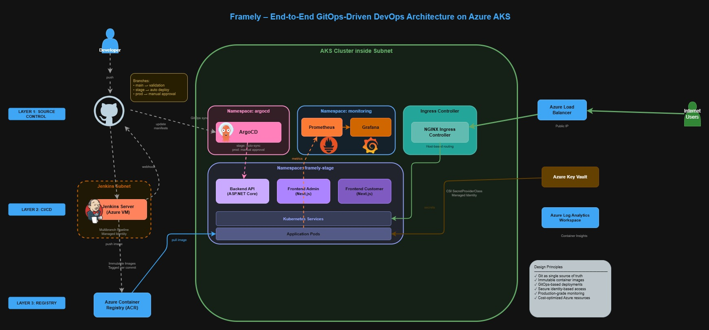
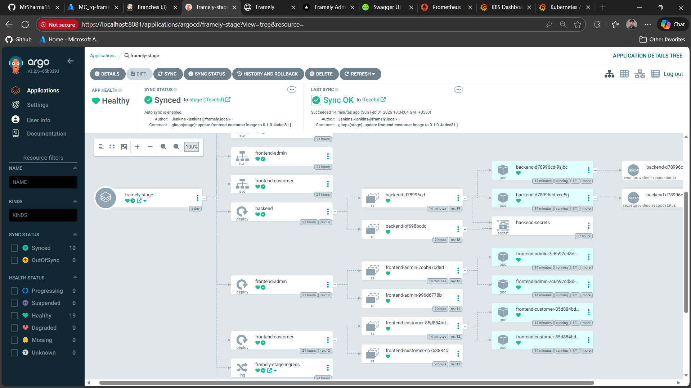
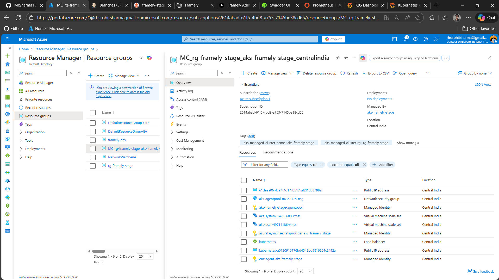
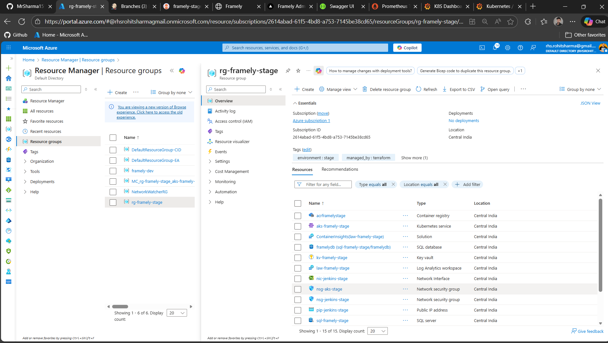

---

# 📦 Framely – Mega DevOps AKS Project

A complete, end-to-end **DevOps and platform engineering implementation** of a real application — designed to **demonstrate modern Kubernetes, GitOps, and CI/CD practices on Azure**.

This repository represents a **cloud-native, Kubernetes-first delivery model** for the Framely application, with a strong focus on:

* CI/CD system design
* GitOps-driven Continuous Delivery
* Infrastructure as Code on Azure
* Clear separation of platform and application concerns


> ✅ **The platform is fully deployed and tested on Azure Kubernetes Service (AKS).**
> Local setup exists only for validation, learning, and debugging.

---

## 🚀 Why This Project Exists

This project was created to:

* 📖 Apply **real-world DevOps and platform engineering concepts**
* 🔄 Design a **production-style CI/CD + GitOps workflow**
* ☸️ Build and operate a **Kubernetes-based delivery platform on AKS**
* ⚖️ Compare **PaaS vs Kubernetes/IaaS delivery models**

> ⚠️ This is a **personal learning and showcase project**, not a commercial product.

---

## 🔗 Original Framely Project (Azure PaaS)

The original Framely application was built using **Azure PaaS services** and is live on Azure.

👉 **Original PaaS Repository**
[https://github.com/MrSharma151/Framely.git](https://github.com/MrSharma151/Framely.git)

That repository demonstrates:

* Azure App Service
* Azure Static Web Apps
* Azure SQL Database
* Azure Blob Storage
* GitHub Actions–based CI/CD

This AKS repository does **not replace** the PaaS version.
Instead, it explores **how the same application can be delivered using Kubernetes, GitOps, and infrastructure automation**.

---

## 🧠 What This Repository Represents

A **DevOps-focused, platform-first implementation** of the Framely application, built around:

* 🐳 Docker-based containerization
* ☸️ Kubernetes-first runtime model
* 🔄 GitOps-driven Continuous Delivery
* 🧩 Strict separation of CI, CD, and infrastructure
* 🌱 Environment promotion via Git (`stage → prod`)

> The application code is treated as **stable input**.
> The primary focus is **delivery architecture and operational correctness**.

---

## 🧱 High-Level Platform Overview

### Application Layer

* Backend API: **ASP.NET Core (stateless)**
* Frontend (Customer): **Next.js**
* Frontend (Admin): **Next.js**
* Database: **Azure SQL Database**
* Object Storage: **Azure Blob Storage**

### DevOps & Platform Stack

* 🐳 Docker (containerization)
* ☸️ Kubernetes (AKS, KIND for local validation)
* 🛠️ Kustomize (application manifests)
* 🔧 Jenkins (Continuous Integration)
* 🚀 ArgoCD (GitOps-based Continuous Delivery)
* 🌍 Terraform (Azure infrastructure provisioning)
* ⚙️ Ansible (Jenkins VM configuration)
* 📊 Prometheus & Grafana (application monitoring)
* 📡 Azure Log Analytics (infrastructure monitoring)

---

## 🖼️ Platform Architecture (Visual Overview)



---

## 📂 Repository Structure

```text
framely/
├── CONTRIBUTING.md     # Contribution & usage guidelines
├── Jenkinsfile         # CI entry point (multibranch pipeline)
├── LICENSE             # Project license
├── README.md           # Project overview (this file)
│
├── apps/               # Application source code & Dockerfiles
├── jenkins/            # Jenkins pipelines and shared CI libraries
├── argocd/             # GitOps configuration (projects & applications)
├── kubernetes/         # Kubernetes manifests (stage & prod)
├── terraform/          # Azure infrastructure as code
├── ansible/            # Jenkins VM configuration
├── monitoring/         # Observability documentation
│
├── docs/               # Architecture, workflow, and setup documentation
├── diagrams/           # Architecture diagrams & screenshots
```

> Each major directory contains its own **README.md** and acts as the **single source of truth** for that layer.

---

## 🌿 Branching & Environment Model

| Branch  | Purpose                             | Environment |
| ------- | ----------------------------------- | ----------- |
| `main`  | Design validation & source of truth | None        |
| `stage` | Integration & pre-production        | AKS (Stage) |
| `prod`  | Controlled releases                 | AKS (Prod)  |

* Jenkins behavior varies by branch
* Jenkins **never deploys** to Kubernetes
* ArgoCD is the **only deployment engine**
* Environment promotion happens via **Git commits**


📘 See: `docs/BRANCHING-AND-CI-CD-WORKFLOW-STRATEGY.md`

---

## ☸️ GitOps Delivery Model

* Git defines the **desired state**
* Jenkins updates Git (**image tags only**)
* ArgoCD reconciles Kubernetes clusters
* ❌ No manual `kubectl apply` for application workloads



This ensures **deterministic, auditable, and reproducible deployments**.

---

## 🧪 Local Development & Validation

The entire platform can be validated on a **single Linux machine**, without AKS.

Supported local workflows:

* 🐳 Docker Compose–based application testing
* ☸️ Local Kubernetes using KIND
* 🔧 Jenkins CI execution
* 🚀 ArgoCD-based GitOps validation

📘 Setup guide: `docs/LOCAL-DEV-SETUP.md`

> Local execution is **for validation only**.
> **AKS remains the authoritative runtime environment.**

---

## 📊 Azure Resources (stage env)





* Multiple node pools
* GitOps-managed workloads
* ArgoCD-controlled deployments
* Azure-native infrastructure integration

---

## 📚 Documentation Index

Key documentation under `docs/`:

* `ARCHITECTURE-OVERVIEW.md` – System architecture
* `BRANCHING-AND-CI-CD-WORKFLOW-STRATEGY.md` – CI/CD & GitOps flow
* `LOCAL-DEV-SETUP.md` – End-to-end local validation

Module-level READMEs exist inside each major directory.

---

## 🧠 Design Philosophy

This project prioritizes:

* 🎓 Learning through **realistic implementation**
* 🧩 Strong separation of concerns
* 📂 Git as the control plane
* ⚡ Deterministic and auditable behavior
* ✨ Clarity over over-engineering

The result is a **clean, production-aligned DevOps platform**.

---

## 👤 Author

**Rohit Sharma**
DevOps Engineer
🌐 [https://rohitsharma.org](https://rohitsharma.org)

---

## 📄 License

This project is licensed under the **MIT License**.

---

