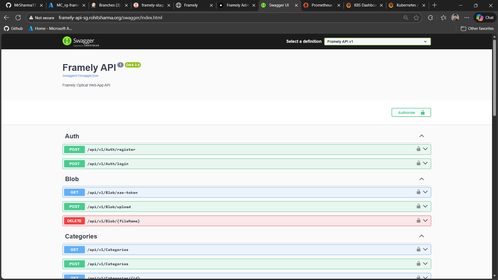
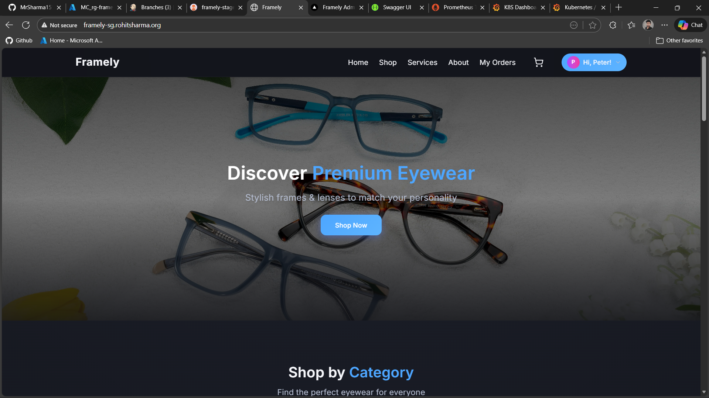
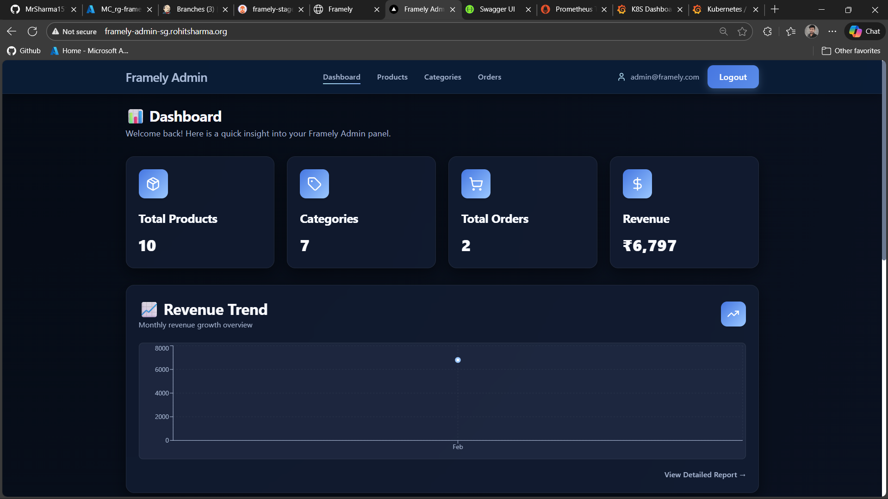

---

# 🧩 Framely Applications

This directory contains **all application services** for the Framely platform.
It serves as the **authoritative source of truth** for:

* Application responsibilities and service boundaries
* Docker images and Dockerfiles
* Runtime configuration contracts
* Kubernetes (AKS) execution assumptions

The application structure is **finalized and stable**.
No architectural or structural changes are expected in this directory.

---

## 📂 Directory Structure

```text
apps/
├── README.md                # Application-level documentation (this file)
├── docker-compose.yml       # Local orchestration (development & validation only)
├── backend                  # ASP.NET Core Backend API
├── frontend-admin           # Admin Dashboard (Next.js)
└── frontend-customer        # Customer Storefront (Next.js)
```

---

## 🧱 Services Overview

### Backend API (`apps/backend`)

**Type:** ASP.NET Core API
**Role:** Central business and data service (single source of truth)

**Responsibilities**

* Authentication and authorization (JWT, role-based access)
* User, product, category, and order management
* Database access using Entity Framework Core
* Blob/file storage integration
* CORS enforcement for frontend clients

**Characteristics**

* Stateless
* Database-driven
* Restart-safe
* Idempotent startup (migrations and role seeding)

**Containerization**

* Multi-stage Dockerfile
* Non-root runtime user
* Production-grade container image



📘 See: `apps/backend/README.md`

---

### Frontend – Customer (`apps/frontend-customer`)

**Type:** Next.js (App Router)
**Role:** Public customer-facing storefront

**Responsibilities**

* Product browsing and search
* User authentication
* Cart and checkout flow
* Order history and tracking

**Characteristics**

* Fully stateless
* Consumes backend APIs only
* No direct database access
* CDN- and ingress-friendly

**Containerization**

* Next.js standalone build
* Build-time environment variable injection
* Minimal runtime image
* Non-root container execution



📘 See: `apps/frontend-customer/README.md`

---

### Frontend – Admin (`apps/frontend-admin`)

**Type:** Next.js (App Router)
**Role:** Internal administrative dashboard

**Responsibilities**

* Product and category management
* Order management
* Administrative workflows
* Role-protected UI access

**Characteristics**

* Fully stateless
* Admin-only access
* Consumes backend APIs only

**Containerization**

* Next.js standalone build
* Build-time environment variable injection
* Minimal runtime image
* Non-root container execution



📘 See: `apps/frontend-admin/README.md`

---

## 🐳 Docker Image Contracts

Each application:

* Has **exactly one Dockerfile**
* Builds a **single immutable container image**
* Receives configuration **only through environment variables**

All Dockerfiles are:

* Production-grade
* Kubernetes (AKS) compatible
* Considered **frozen** (no functional changes expected)

---

## ⚙️ Environment Variable Contracts (Critical)

This section defines the **stable runtime configuration contract** for all services.

---

### Backend Environment Variables

| Variable                               | Required | Description                |
| -------------------------------------- | -------- | -------------------------- |
| `ASPNETCORE_ENVIRONMENT`               | ✅        | Runtime environment        |
| `ASPNETCORE_URLS`                      | ✅        | HTTP bind address          |
| `ConnectionStrings__DefaultConnection` | ✅        | Database connection string |
| `JwtSettings__Secret`                  | ✅        | JWT signing key            |
| `JwtSettings__Issuer`                  | ✅        | JWT issuer                 |
| `JwtSettings__Audience`                | ✅        | JWT audience               |
| `JwtSettings__ExpiresInMinutes`        | ❌        | Token expiry               |
| `FrontendOrigins__*`                   | ✅        | Allowed CORS origins       |
| `SeedAdmin`                            | ❌        | Admin seeding flag         |
| `Storage__ConnectionString`            | ✅        | Blob storage connection    |
| `Storage__Container`                   | ✅        | Storage container name     |
| `Storage__Name`                        | ✅        | Storage account name       |
| `Storage__Key`                         | ✅        | Storage access key         |

**Rules**

* Secrets must be stored in **Kubernetes Secrets**
* Non-sensitive values must be stored in **ConfigMaps**
* No production defaults are assumed

---

### Frontend Environment Variables

(Customer and Admin)

| Variable                   | Required | Description                   |
| -------------------------- | -------- | ----------------------------- |
| `NEXT_PUBLIC_API_BASE_URL` | ✅        | Backend API base URL          |
| `NEXT_PUBLIC_BASE_PATH`    | ❌        | Local path-based routing only |

**Notes**

* `NEXT_PUBLIC_*` variables are **build-time values**
* Any change requires a **new container image**
* This behavior is intentional and enforced

---

## 🧪 docker-compose.yml (Local Validation Only)

`apps/docker-compose.yml` is used exclusively for **local development and validation**.

It enables:

* End-to-end service integration testing
* Validation of environment variable contracts
* Running the complete system on a single machine

It is **not used** in Kubernetes or production environments.

Included services:

* SQL Server (local only)
* Backend API
* Customer frontend
* Admin frontend

---

## 🧠 Design Constraints (Non-Negotiable)

1. Applications are **stateless**
2. No configuration is baked into container images
3. Databases and storage are external dependencies
4. Environment variables define the runtime contract
5. The **same image runs across all environments**

These constraints are enforced in the codebase and CI pipeline.

---

## 🧪 Testing Expectations

* **Backend**

  * Unit tests
  * Integration tests
* **Frontend**

  * Jest-based unit and component tests
* **CI**

  * Tests executed before image build
* **CD**

  * Only validated images are promoted

---

## 🏁 Final Notes

* The `apps/` directory is **finalized**
* Represents a **production-grade application layer**
* Safe to treat as long-term technical documentation
* No re-architecture or refactor is expected

---

