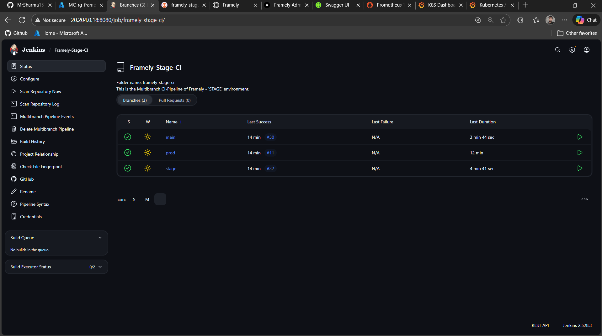
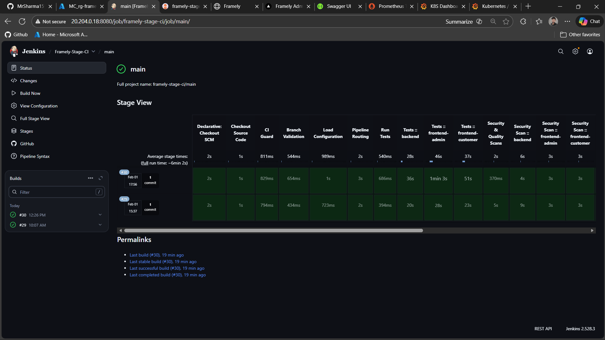
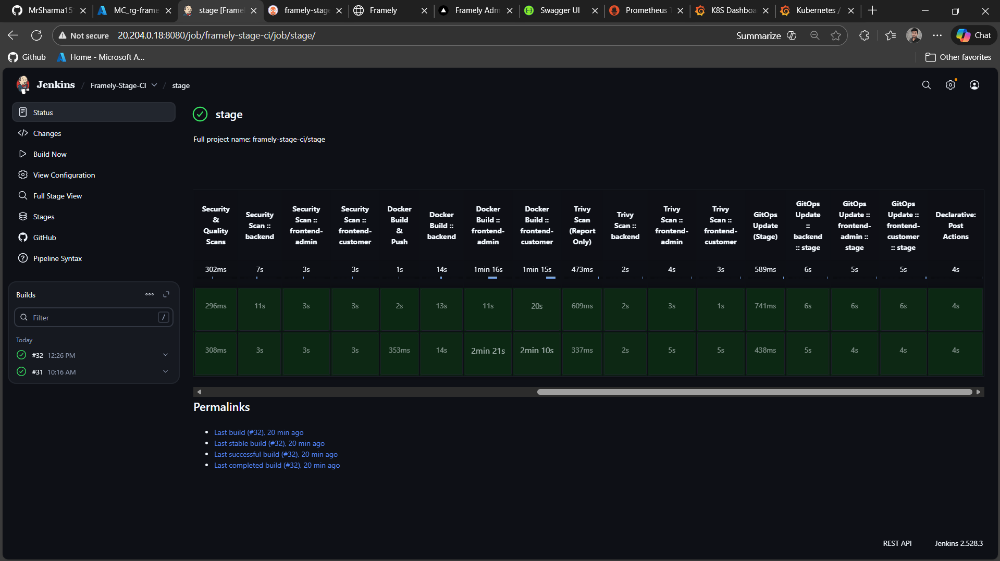
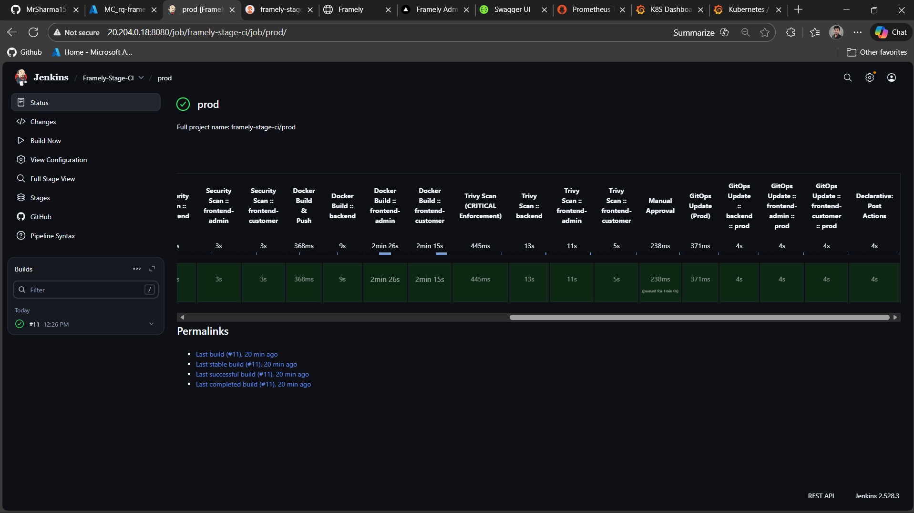
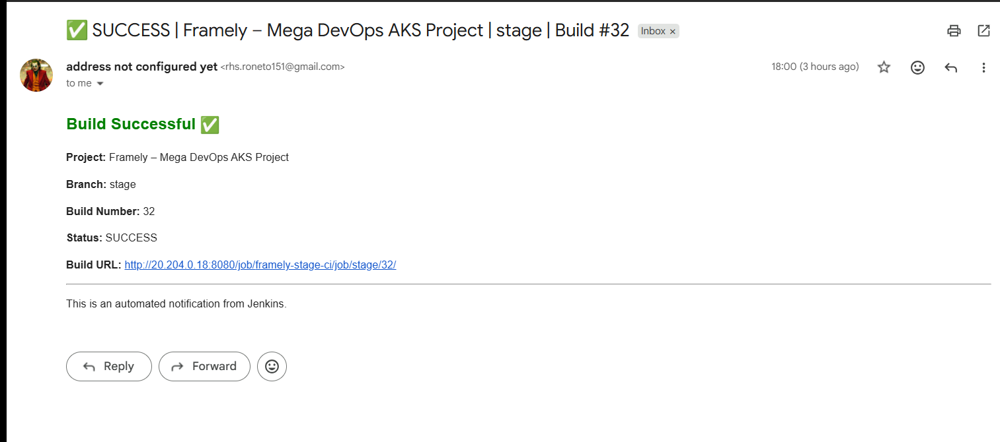

---

# 📘 Jenkins CI Configuration

## Framely – Mega DevOps AKS Project

---




## 🎯 Purpose of Jenkins in Framely

In the Framely platform, Jenkins is used **exclusively for Continuous Integration (CI) and GitOps orchestration**, with **built-in DevSecOps enforcement**.

Jenkins is responsible for **building, validating, scanning, and promoting artifacts**.
It does **not** deploy workloads.

> Jenkins builds and updates Git.
> ArgoCD deploys declared state from Git.
> Kubernetes executes only what ArgoCD applies.

---

## 🧱 Scope of Responsibility

### ✅ In Scope

Jenkins performs the following functions:

* Executes unit and integration tests
* Runs dependency and container security scans
* Builds Docker images
* Pushes images to container registries
* Updates Kubernetes manifests **via GitOps commits**

---

### ❌ Out of Scope

Jenkins explicitly does **not**:

* Deploy applications to Kubernetes
* Run `kubectl apply`
* Modify cluster state
* Trigger or control ArgoCD synchronization

Deployment responsibility belongs **exclusively** to ArgoCD.

---

## 📂 Jenkins Directory Structure

```text
jenkins/
├── README.md                # Module documentation (this file)
│
├── config/                  # Declarative pipeline configuration
│   ├── apps.yaml            # Application contracts and build requirements
│   ├── images.yaml          # Logical image naming
│   └── registries.yaml      # Registry configuration per environment
│
├── pipelines/               # Branch-specific pipeline logic
│   ├── ci-main.groovy       # Validation-only pipeline
│   ├── ci-stage.groovy      # CI + GitOps promotion (stage)
│   ├── ci-prod.groovy       # CI + controlled promotion (prod)
│   └── terraform.groovy     # Infrastructure pipeline (reserved)
│
└── shared/                  # Reusable pipeline building blocks
    ├── tests.groovy         # Test execution logic
    ├── security.groovy      # Dependency scanning
    ├── docker.groovy        # Docker build and push
    ├── trivy.groovy         # Container vulnerability scanning
    └── gitops.groovy        # GitOps image update logic
```

Only actively used shared components are retained to keep the CI system **explicit, minimal, and auditable**.

---

## 📄 Jenkinsfile (Repository Root)

The `Jenkinsfile` located at the repository root is the **single pipeline entry point**.

### Responsibilities

* Detect branch context (multibranch pipeline)
* Prevent GitOps-triggered CI loops using `[skip ci]`
* Load declarative configuration:

  * `apps.yaml`
  * `images.yaml`
  * `registries.yaml`
* Route execution to the appropriate pipeline

---

### Branch-to-Pipeline Mapping

| Branch  | Pipeline          | Purpose                            |
| ------- | ----------------- | ---------------------------------- |
| `main`  | `ci-main.groovy`  | Validation and developer feedback  |
| `stage` | `ci-stage.groovy` | Automated pre-production promotion |
| `prod`  | `ci-prod.groovy`  | Controlled production release      |

---

## 🧠 Pipeline Design Principles

This Jenkins setup follows a **progressive DevSecOps model**:

* Security is enforced incrementally
* Enforcement strength increases per environment
* Pipelines remain deterministic and repeatable
* CI logic is environment-agnostic

---

## 🔁 Pipeline Responsibilities by Environment

### `ci-main` — Validation Only

**Purpose:** Developer feedback without side effects

**Stages**

* Unit and integration tests
* Dependency security scans
* Docker build validation
* Trivy scan (report-only)

**Behavior**

* No image push
* No GitOps updates
* Pipeline never fails on vulnerabilities




---

### `ci-stage` — Pre-Production Promotion

**Purpose:** Enforced visibility before production

**Stages**

* Tests
* Dependency scans
* Docker build and push
* Trivy scan (enforced visibility)
* GitOps image update

**Behavior**

* CRITICAL and HIGH vulnerabilities are reported
* Pipeline does not fail
* ArgoCD auto-syncs the stage environment




---

### `ci-prod` — Controlled Release

**Purpose:** Production safety and change control

**Stages**

* Tests
* Security scans
* Docker build and push
* Trivy scan (strict enforcement)
* Manual approval gate
* GitOps image update

**Behavior**

* Pipeline fails on **CRITICAL vulnerabilities**
* HIGH vulnerabilities remain visible
* ArgoCD synchronization is manual




---

## 🔐 Container Security with Trivy

Trivy is used for container image vulnerability scanning.

### Scan Scope

* OS-level packages
* Language dependencies
* Known CVEs from upstream databases

---

### Enforcement Policy

| Environment | Scan Mode           | Pipeline Failure |
| ----------- | ------------------- | ---------------- |
| `main`      | Report only         | No               |
| `stage`     | Enforced visibility | No               |
| `prod`      | Strict enforcement  | CRITICAL only    |

Jenkins **reports and enforces security**.
It does not attempt vulnerability remediation.

---

## 🌐 Frontend Build-Time Configuration

Both frontend applications are **Next.js–based**.

### Key Constraint

* `NEXT_PUBLIC_*` variables are **resolved at build time**
* Any configuration change requires a **new image build**

---

### Configuration Contract (`apps.yaml`)

```yaml
buildArgs:
  NEXT_PUBLIC_API_BASE_URL: __API_BASE_URL__
```

* `apps.yaml` defines required variables
* Environment-specific values are injected by pipelines
* Prevents configuration drift

---

### Environment Binding

| Pipeline   | Behavior                    |
| ---------- | --------------------------- |
| `ci-main`  | Placeholder values allowed  |
| `ci-stage` | Stage API URL injected      |
| `ci-prod`  | Production API URL injected |

---

## 🐳 Docker Image Metadata Contract

```text
Image: <registry>/framely-backend
Tag:   <version>-<git-sha>
```

### Rationale

* Prevents tag collisions
* Ensures clean GitOps diffs
* Maintains Kustomize correctness

---

## 🔁 GitOps Update Strategy

Image updates are performed using:

```bash
kustomize edit set image <image>=<image>:<tag>
```

Rules:

* Image names must match Kubernetes manifests exactly
* Image values are overwritten, never appended
* Prevents ArgoCD synchronization errors

---

## 🧰 Required Global Tooling

Jenkins runs as the system user `jenkins`.

All tools must be available **system-wide**.

| Tool               | Purpose                     |
| ------------------ | --------------------------- |
| Git                | Source control and GitOps   |
| Docker             | Image build and push        |
| .NET SDK 9.x       | Backend CI                  |
| Node.js 20.x + npm | Frontend CI                 |
| Trivy              | Container security scanning |
| Kustomize          | GitOps manifest updates     |

---

## 🔐 Credentials Used

| Credential        | Purpose                              |
| ----------------- | ------------------------------------ |
| `github-pat`      | Repository access and GitOps commits |
| `acr-credentials` | Azure Container Registry access      |

---

## ☁️ Environment Compatibility

| Aspect          | Local      | AKS       |
| --------------- | ---------- | --------- |
| Jenkins runtime | Local host | Azure VM  |
| Registry        | Docker Hub | Azure ACR |
| Kubernetes      | KIND       | AKS       |
| Pipelines       | Same       | Same      |
| GitOps flow     | Same       | Same      |

Infrastructure changes do not impact CI logic.

---

## Email Notification on each events of pipelines:




---

## 📌 Usage Rules

* Jenkins must not access Kubernetes directly
* All deployments must flow through ArgoCD
* Git remains the single source of truth
* Pipelines must remain stateless and reproducible

---

## 🏁 Final Notes

* Jenkins configuration is **environment-agnostic**
* Pipelines are **config-driven**
* Security enforcement is **progressive and deterministic**
* Actively used in an **AKS-based delivery pipeline**

This module defines the **authoritative CI behavior** for the Framely platform.

---

