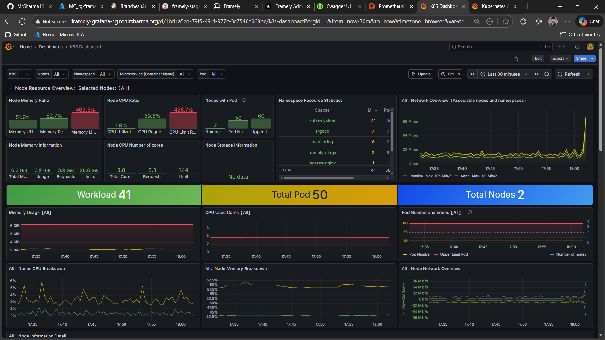
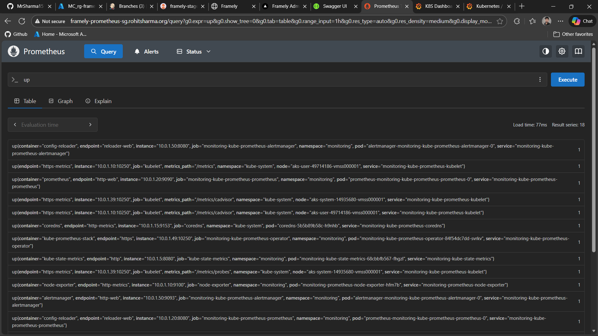
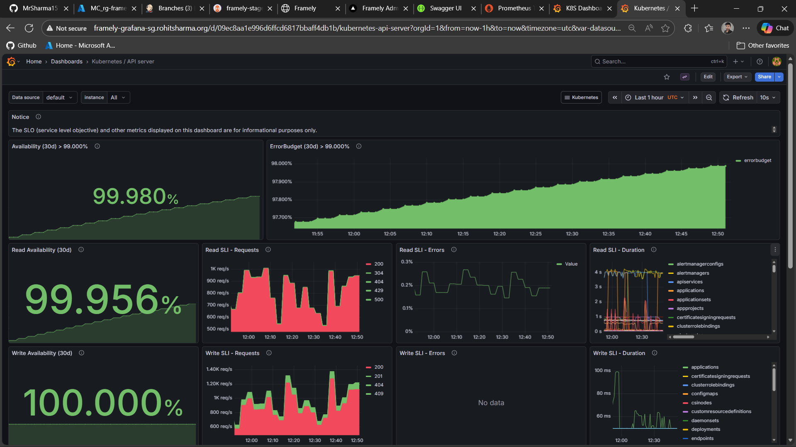

---

## 📊 Observability

### Framely – Mega DevOps AKS Project

---

## 🎯 Purpose of This Directory

This directory documents the **observability strategy** for the Framely platform.

It defines how monitoring and visibility are handled across:

* Kubernetes clusters running on AKS
* Application workloads deployed via GitOps

The observability stack is **intentionally split by responsibility** to align with production-grade, cloud-native practices.

---

## 🧠 Observability Model

Framely follows a **hybrid observability approach**:

* **Azure-native monitoring** for infrastructure and Kubernetes platform signals
* **Cloud-native tooling (Prometheus and Grafana)** for application-level metrics

This separation provides:

* Clear ownership boundaries
* Reduced coupling between cloud provider and application monitoring
* Easier portability across environments
* Controlled monitoring and ingestion costs

---

## 📘 Azure Log Analytics

### Infrastructure and Cluster Observability

Azure Log Analytics is used for **platform-level monitoring** of AKS.

### Scope

* AKS cluster health
* Node and node pool metrics
* Control plane diagnostics
* Azure resource logs

### Characteristics

* Integrated with AKS during cluster provisioning via Terraform
* Used for:

  * Cluster availability
  * Node health
  * Resource utilization
  * Infrastructure diagnostics
* **Not used for application-level metrics**

Application metrics are intentionally excluded to avoid vendor lock-in and unnecessary ingestion costs.

---

## 📈 Prometheus and Grafana

### Application Observability

Application metrics are handled using **Prometheus and Grafana**, deployed **inside the Kubernetes cluster**.

### Deployment Model

* Installed using **Helm charts**
* Deployed as **platform components**
* Isolated from application workloads
* Managed independently of application release cycles

### Responsibilities

* Application and service-level metrics collection
* Metrics visualization through Grafana dashboards
* Operational visibility during development and validation
* Alerting support (when enabled)

### Rationale

* Kubernetes-native observability stack
* Industry-standard tooling
* Cloud-provider independent
* Consistent behavior across stage and production environments

---

## 📁 Directory Scope

The `monitoring/` directory serves as a **logical boundary** for observability concerns.

It contains:

* Documentation of the observability architecture
* Design decisions related to monitoring
* References to platform-level monitoring components

At this stage, the directory focuses on **documentation and architectural intent**.

Platform tooling (Helm values, dashboards, alerts) is managed separately and can be expanded as needed.

---

## 🎯 Design Constraints

* Infrastructure monitoring is separate from application monitoring
* Observability tooling is treated as **platform infrastructure**
* Kubernetes-native and GitOps-compatible
* Cost-aware and production-aligned
* No application coupling to cloud-provider monitoring APIs

---

## 🚀 Optional Extensions

The observability stack can be extended to include:

* Prometheus alert rules
* Grafana dashboards as code
* Alertmanager integration
* External metrics adapters for HPA

These enhancements are optional and can be introduced incrementally without impacting application workloads.

---

## 🏁 Summary

* **Azure Log Analytics** provides infrastructure and AKS-level visibility
* **Prometheus and Grafana** handle application-level metrics
* **Helm-based deployment** ensures cluster-native observability
* Clear separation of concerns enables a scalable and maintainable monitoring strategy

This directory documents the **authoritative observability model** for the Framely platform.

---

